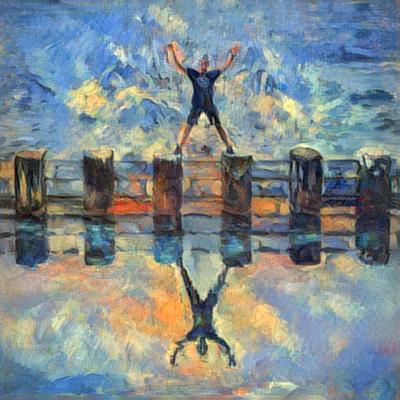

```{r, include=FALSE}
knitr::opts_chunk$set(
  results='asis', 
  echo = FALSE
)

library(glue)
library(tidyverse)
library(vitae)
library(rorcid)


orcid_jordi<-"0000-0002-5979-8948"

# Set this to true to have links turned into footnotes at the end of the document
PDF_EXPORT <- F

# Holds all the links that were inserted for placement at the end
links <- c()

source('parsing_functions.R')

# Load csv with position info
position_data <- read_csv('positions.csv')

```


```{r}
# When in export mode the little dots are unaligned, so fix that. 
if(PDF_EXPORT){
  cat("
  <style>
  :root{
    --decorator-outer-offset-left: -6.5px;
  }
  </style>")
}
```


Aside
================================================================================


{width=100%}

```{r}
# When in export mode the little dots are unaligned, so fix that. 
if(PDF_EXPORT){
  cat("View this CV online with links at [_jrealgatius/CV_](https://github.com/jrealgatius/CV)")
} else {
  cat("[<i class='fas fa-download'></i> Download a PDF of this CV](https://github.com/jrealgatius/CV/blob/master/Jordi Real’s CV.pdf)")
}


```

Contact {#contact}
--------------------------------------------------------------------------------


- <i class="fa fa-envelope"></i> jordireal@gmail.com
- <i class="fa fa-twitter"></i> JordirealReal
- <i class="fa fa-github"></i>  [github/jrealgatius](https://github.com/jrealgatius)
- <i class="fa fa-link"></i> [researchgate](https://www.researchgate.net/profile/Jordi_Real)
- <i class="fa fa-phone"></i> (+34) 600 22 94 43


Statistical software skills {#skills}
--------------------------------------------------------------------------------

```{r}
skills <- tribble(
  ~skill,               ~level,
  "R",                  5,
  "SPSS",               5,
  "Stata",              3.5,
  "SAS",                1.5
)

build_skill_bars(skills)
```


Disclaimer {#disclaimer}
--------------------------------------------------------------------------------

Made with the R package [**pagedown**](https://github.com/rstudio/pagedown). 

The source code is available at [github.com/jrealgatius/cv](https://github.com/jrealgatius/cv).

Last updated on `r Sys.Date()`.


Main
================================================================================

Jordi Real {#title}
--------------------------------------------------------------------------------


```{r}
intro_orcid<-rorcid::orcid_bio(orcid_jordi)[[1]]$content

cat(sanitize_links(intro_orcid))
```


Education {data-icon=graduation-cap data-concise=true}
--------------------------------------------------------------------------------

```{r}
# print_section(position_data, 'education')

# Extreure orcid
sumari_educ<-rorcid::orcid_educations(orcid_jordi)[[1]]$`affiliation-group`$summaries
edu<-sumari_educ %>% purrr::map_df(~rbind(.x))

# Formatejar 
edu_makejat<- edu %>% transmute(
  section="education",
  in_resume=TRUE,
  title=`education-summary.role-title`,
  institution=`education-summary.organization.address.city`,
  loc=`education-summary.organization.name`,
  start=`education-summary.start-date.year.value`,
  end=`education-summary.end-date.year.value`,
  description_1=`education-summary.department-name`)


print_section(edu_makejat, 'education')

```


Work Experience {data-icon=laptop}
--------------------------------------------------------------------------------

```{r}

# Extreure treballs i posar-ho en un Data frame 
res<-rorcid::orcid_employments(orcid_jordi)
sumari_empl<-res[[1]]$`affiliation-group`$summaries
sumari_empl<-sumari_empl %>% purrr::map_df(~rbind(.x))

# Formatar-ho per pagedown
laboral_makejat<- sumari_empl %>% transmute(
  section="laboral",
  in_resume=TRUE,
  title=`employment-summary.role-title`,
  institution=`employment-summary.organization.address.city`,
  loc=`employment-summary.organization.name`,
  start=`employment-summary.start-date.year.value`,
  end=`employment-summary.end-date.year.value`,
  description_1=`employment-summary.department-name`)


print_section(laboral_makejat, 'laboral')

```

```{r}

adreca_orcid_jordi<-paste0("(https://orcid.org/",orcid_jordi,")")
text_adreca_orcid<-paste0("I have worked in a variety of articles, ranging to data analyst to researcher to data scientist.The rest of the papers are available in this [link]",adreca_orcid_jordi) 


```


Recent publications (2019) {data-icon=newspaper} 
--------------------------------------------------------------------------------

::: aside
`r text_adreca_orcid`
:::


```{r}
works_jordi<-rorcid::works(rorcid::as.orcid(orcid_jordi))

# Formatar-ho pel pagedown
articles_makejat<- works_jordi %>% transmute(
  section="articles",
  in_resume=TRUE,
  title=`title.title.value`,
  loc=`journal-title.value`,
  institution=NA,
  start=`publication-date.year.value`,
  end=`publication-date.year.value`,
  description_1=NA) %>% as_tibble() %>% 
  filter(start>=2019)


print_section(articles_makejat, 'articles')
```

<br>
<br>
<br>


```{r}
if(PDF_EXPORT){
  cat("
  
Links {data-icon=link}
--------------------------------------------------------------------------------

<br>


")
  
  walk2(links, 1:length(links), function(link, index){
    print(glue('{index}. {link}'))
  })
}
```


